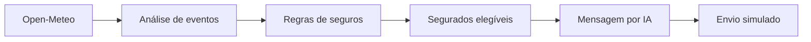

# Alerta Clima Seguro

Protótipo desenvolvido para o **Desafio 5 do InsurMinds/I2A2** do grupo SintonIA. A aplicação monitora previsões meteorológicas, identifica eventos de risco, aplica regras de negócio, seleciona segurados potencialmente afetados, gera comunicações personalizadas com IA e simula o envio das notificações.

## Fluxo da solução



O protótipo separa as responsabilidades em componentes especializados:

1. **Coleta meteorológica:** consulta a previsão dos próximos três dias na Open-Meteo.
2. **Análise climática:** identifica chuva intensa, granizo, vento forte, nevoeiro e tempestade.
3. **Decisão:** cruza cidade afetada e tipo de seguro para selecionar os destinatários.
4. **Comunicação:** utiliza um modelo de linguagem para criar mensagens preventivas personalizadas.
5. **Notificação:** registra canal, destinatário, conteúdo e status do envio simulado.

## Modos de demonstração

- **Monitoramento real:** envia notificações somente quando a previsão da Open-Meteo atinge os limites configurados.
- **Cenário demonstrativo:** consulta a Open-Meteo e utiliza três eventos didáticos claramente identificados como simulados. Esse modo permite apresentar o fluxo completo mesmo em um dia sem eventos adversos.

O envio real de SMS, WhatsApp, e-mail ou push não é realizado.

## Regras de negócio

| Evento | Critério climático principal | Seguros elegíveis |
| --- | --- | --- |
| Chuva intensa | WMO 65/82, chuva >= 30 mm ou chuva >= 20 mm com probabilidade >= 80% | Residencial, rural e empresarial |
| Granizo | WMO 96 ou 99 | Automóvel, residencial, rural e empresarial |
| Vento forte | Rajadas >= 60 km/h | Automóvel, residencial, rural e empresarial |
| Nevoeiro | WMO 45 ou 48 | Automóvel |
| Tempestade | WMO 95 | Automóvel, residencial, rural e empresarial |

Além da compatibilidade entre evento e seguro, o segurado deve estar cadastrado na cidade afetada.

## Funcionalidades

- Consulta meteorológica atual e previsão de sete dias por cidade.
- Monitoramento preventivo de seis cidades e segurados fictícios.
- Detecção automática de eventos por código WMO e limites numéricos.
- Regras de elegibilidade por cidade e tipo de seguro.
- Mensagens personalizadas por IA.
- Mensagem de contingência caso o provedor de IA esteja indisponível.
- Simulação de envio por WhatsApp, SMS, e-mail ou push.
- Painel com resumo, eventos, destinatários e notificações.
- Documentação interativa da API com Swagger.

## Tecnologias

- Python 3.13
- FastAPI e Uvicorn
- Pydantic
- LangChain e LangChain OpenAI
- OpenRouter para acesso ao modelo de linguagem
- Open-Meteo como fonte pública meteorológica
- HTML, CSS e JavaScript
- Docker

## Estrutura

```text
alerta_clima/
├── app/
│   ├── dados/segurados.json       # Base fictícia de segurados
│   ├── modelos/                   # Contratos Pydantic
│   ├── rotas/                     # Endpoints FastAPI
│   ├── monitoramento.py           # Coleta e orquestração do fluxo
│   ├── regras.py                  # Regras de decisão
│   ├── mensagens.py               # Geração personalizada e fallback
│   ├── request.py                 # Consulta meteorológica tradicional
│   ├── llm.py                     # Configuração do LLM
│   └── main.py                    # Inicialização da aplicação
├── frontend/
│   ├── css/style.css
│   ├── js/script.js
│   └── index.html
├── tests/test_monitoramento.py
├── .env.example
├── Dockerfile
├── requirements.txt
└── README.md
```

## Instalação

### 1. Criar o ambiente virtual

Linux ou macOS:

```bash
python3 -m venv .venv
source .venv/bin/activate
```

Windows PowerShell:

```powershell
py -m venv .venv
.\.venv\Scripts\Activate.ps1
```

### 2. Instalar as dependências

```bash
pip install -r requirements.txt
```

### 3. Configurar as variáveis

Copie `.env.example` para um arquivo chamado `.env` e preencha sua chave:

```env
API_KEY_OPENROUTER=sua_chave
SESSION_SECRET=uma_chave_aleatoria_e_secreta
COOKIE_HTTPS_ONLY=false
LLM_DEBUG=false
```

A Open-Meteo não exige chave. Sem uma chave de IA válida, o fluxo continua funcionando com mensagens preventivas de contingência.

### 4. Executar

```bash
uvicorn app.main:app --host 0.0.0.0 --port 8003
```

Acesse:

- Aplicação: <http://localhost:8003>
- Swagger: <http://localhost:8003/docs>

## Endpoints principais

| Método | Rota | Descrição |
| --- | --- | --- |
| GET | `/` | Interface web |
| GET | `/api/v1/insureds` | Lista os segurados fictícios |
| POST | `/api/v1/monitoring/run` | Executa o monitoramento com dados reais |
| POST | `/api/v1/monitoring/run?demonstracao=true` | Executa o cenário demonstrativo completo |
| POST | `/api/v1/city` | Armazena a cidade da consulta na sessão |
| GET | `/api/v1/current` | Consulta as condições atuais |
| GET | `/api/v1/forecast` | Consulta a previsão de sete dias |
| GET | `/api/v1/tips` | Retorna dicas geradas por IA |
| GET | `/api/v1/cities` | Retorna sugestões de cidades |

## Testes

```bash
python -m unittest discover -s tests -v
```

Os testes validam a identificação dos eventos, a seleção dos segurados e o fluxo completo do cenário demonstrativo.

## Segurança e limitações

- Nunca envie o arquivo `.env` ao GitHub ou no ZIP de entrega.
- Chaves são recebidas somente em tempo de execução e não devem ser gravadas na imagem Docker.
- Os segurados e apólices são fictícios.
- As regras possuem finalidade didática e não representam condições contratuais reais.
- O protótipo não substitui alertas da Defesa Civil, INMET ou outras autoridades.
- O envio das notificações é apenas simulado.

## Licença

Este projeto está licenciado sob a licença MIT. Consulte o arquivo [LICENSE](LICENSE).
